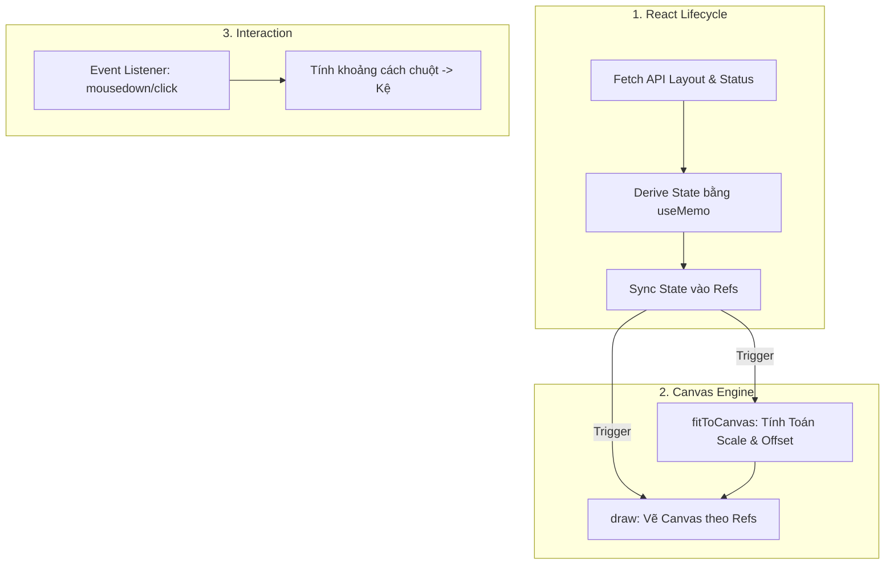

# Phân tích luồng hoạt động của OperatorMapCanvas

Component `OperatorMapCanvas` là trái tim của giao diện bản đồ dành cho nhân viên kho (Operator). Bản đồ này được thiết kế theo hướng **Static Map (bản đồ tĩnh)**, tức là nó sẽ lấy toạ độ vật lý từ backend, tự động thu phóng (fit) sao cho vừa vặn toàn bộ các điểm cần thiết lên màn hình 1 lần duy nhất, và **không** cho phép người dùng kéo thả (pan) hay cuộn chuột (zoom).

Tài liệu này sẽ giải thích chi tiết từng phần của code để bạn có thể tự tin refactor thêm nếu cần.

---

## 1. Kiến trúc tổng quan (Architecture)

Bản đồ được chia làm 3 luồng chính kết hợp chặt chẽ với nhau:



### Tại sao lại dùng `useRef` quá nhiều?
Canvas API là một API imperative (mệnh lệnh), trong khi React là declarative (khai báo). Hàm `draw()` và các hàm lắng nghe sự kiện (`onClick`) nếu dùng trực tiếp các state của React sẽ rất dễ bị **stale closure** (nhớ giá trị cũ). 
=> Giải pháp: Đồng bộ toàn bộ dữ liệu (từ props và API) vào `useRef`. Hàm `draw` và `onClick` chỉ đọc dữ liệu từ `ref.current`. Điều này giúp hiệu năng cực cao vì khi ref thay đổi, React không bị ép render lại toàn bộ component DOM.

---

## 2. Giải phẫu chi tiết từng phần

### Phần 1: Khai báo API & Tính toán dữ liệu (Derive State)

```tsx
// 1. Fetch dữ liệu thô từ backend
const { data: layoutResponse } = useZoneMapLayout(zoneId); // Lấy toạ độ (map_x, map_y)
const { data: statusResponse } = useZoneMapStatus(zoneId); // Lấy trạng thái, tồn kho

// 2. Chế biến lại dữ liệu bằng useMemo
const labelByCode = useMemo(() => {
  // Trả về map để Canvas biết cần vẽ Label gì trên kệ (vd: Tên SKU, số lượng)
}, [statusResponse]);

const bufferCodes = useMemo(() => {
  // Trả về 1 Set các mã location đang hoạt động/cần quan tâm.
  // Các kệ không nằm trong danh sách này sẽ bị làm mờ (dimmed) hoặc ẩn đi.
}, [statusResponse]);
```
> **TIP:** `useMemo` ở đây cực kỳ quan trọng. Hàm `draw()` sẽ chạy rất nhiều lần (khi resize cửa sổ, khi click, v.v.). Việc duyệt lại array hàng ngàn location thành object/Set mất kha khá thời gian. Dùng `useMemo` đảm bảo ta chỉ tính toán 1 lần duy nhất khi API có data mới.

### Phần 2: Đồng bộ vào Refs & Khởi tạo Nodes

Ngay khi có dữ liệu từ `layoutResponse`, React chạy `useEffect` để biến dữ liệu backend thành `nodesRef` (danh sách các điểm sẽ vẽ lên bản đồ).

```tsx
useEffect(() => {
  // Lọc bỏ các toạ độ lỗi (0, 0)
  const nodes = layoutResponse.nodes
    .filter((n) => n.map_x !== 0 || n.map_y !== 0)
    .map((n) => ({
      x: n.map_x,
      y: n.map_y,
      type: 1, // 1 là Kệ (Shelf), 0 là điểm nối (Waypoint)
      content: n.location_code
    }));
  
  nodesRef.current = nodes;

  // Tính toán vùng biên (Bounding Box) bao quanh toàn bộ các điểm này
  contentBoundsRef.current = boundsFromNodes(nodes);

  // Gọi hàm tính toán tỉ lệ thu phóng và vẽ
  fitToCanvas();
}, [layoutResponse, ...]);
```

### Phần 3: Thu phóng và Căn giữa (`fitToCanvas`)

Vì toạ độ từ backend là toạ độ thực tế (ví dụ: `x=15000, y=20000`), không thể vẽ thẳng lên màn hình máy tính (rộng 1000px). Ta phải tính `scale` và `offset`.

```tsx
const fitToCanvas = useCallback(() => {
  // bounds: Chứa width, height thật sự của kho (World Space)
  // canvas: Chứa width, height của màn hình (Screen Space)
  
  // 1. Tính toán tỉ lệ Scale
  const scale = Math.min(availW / bounds.width, availH / bounds.height);
  const lockedScale = scale * opts.fitScaleFactor;
  scaleRef.current = lockedScale;

  // 2. Tính toán độ dịch chuyển (Offset) để căn giữa kho vào màn hình
  offsetXRef.current = pad + (availW - bounds.width * lockedScale) / 2 - bounds.minX * lockedScale;
  offsetYRef.current = pad + (availH - bounds.height * lockedScale) / 2 - bounds.minY * lockedScale;
}, []);
```

### Phần 4: Vòng lặp vẽ (`draw`)

Đây là nơi Canvas thực sự hoạt động. Thứ tự vẽ được thực hiện tuần tự.

```tsx
const draw = useCallback(() => {
  ctx.clearRect(0, 0, canvas.width, canvas.height); // Xoá khung hình cũ

  // Bước 1: Kích hoạt hệ trục toạ độ mới bằng Transform.
  // Nhờ hàm setTransform này, ta chỉ cần truyền toạ độ x, y thật (World Space).
  // Canvas sẽ TỰ ĐỘNG nhân với scale và cộng offset để ra toạ độ trên màn hình.
  ctx.setTransform(scaleRef.current, 0, 0, scaleRef.current, offsetXRef.current, offsetYRef.current);

  // Bước 2: Duyệt qua toàn bộ danh sách điểm
  for (const node of nodesRef.current) {
    if (node.type === 0) {
       // Vẽ Waypoint
    }
    
    if (node.type === 1) {
       // Vẽ Kệ (Shelf)
       if (isActive) {
           drawBufferCellByStatus(...); // Tô màu trạng thái (xanh, đỏ)
       } else {
           drawDimmedCell(...); // Làm mờ
       }
       
       if (isSelected) drawSelectedHighlight(...); // Viền sáng khi click
       drawShelfStockLabel(...); // Text nhãn
    }
  }
});
```

### Phần 5: Tính toán Va chạm (Hit Test / Clicks)

Khi User bấm chuột lên màn hình, ta nhận được toạ độ `(sx, sy)` là toạ độ màn hình (Screen Space). Ta phải dịch ngược nó về toạ độ backend (World Space) để biết user đang bấm vào đâu.

```tsx
const resolveClickPayload = (e: MouseEvent) => {
  // 1. Lấy toạ độ chuột (Screen Space)
  const sx = e.clientX - rect.left;
  const sy = e.clientY - rect.top;

  // 2. Dịch ngược về toạ độ gốc (World Space)
  const wx = (sx - offsetXRef.current) / scaleRef.current;
  const wy = (sy - offsetYRef.current) / scaleRef.current;

  // 3. Tìm kệ gần con chuột nhất
  const hitRadius = shelfHalf * 0.55; // Bán kính bắt dính
  let closestDist = Infinity;
  let closestNode = null;

  for (const node of nodesRef.current) {
    // Tính khoảng cách Pitago
    const dist = Math.hypot(wx - node.x, wy - node.y);
    if (dist <= hitRadius && dist < closestDist) {
      closestDist = dist;
      closestNode = node;
    }
  }
  
  return closestNode;
};
```
> **NOTE:** Ta dùng `Math.hypot` (công thức Pitago) để đo khoảng cách tuyệt đối. Nếu khoảng cách đó nhỏ hơn bán kính kệ (`hitRadius`), tức là người dùng đã bấm trúng kệ đó.

---

## 3. Ý tưởng Refactor / Mở rộng sau này

1. **Thêm Filter:** Nếu muốn "Lọc kệ theo SKU", tạo 1 React State `filteredSkus`. Pass nó vào dependencies của 1 `useEffect`, bên trong `useEffect` đó filter lại `bufferCodesRef.current` và gọi `draw()`. Bản đồ sẽ thay đổi ngay lập tức.
2. **Tuỳ chỉnh màu sắc:** Sửa các hằng số màu sắc ở đầu file `OperatorMapCanvas.tsx`, hoặc chỉnh trong file `warehouseMapShelfDraw.ts`.
3. **Tooltip khi Hover:** Hiện tại bản đồ bắt sự kiện `click`. Nếu muốn làm Tooltip khi hover, thêm sự kiện `mousemove` vào canvas, dùng `resolveClickPayload` -> Nếu có node thì set một State chứa thông tin node đó để render tooltip nổi.
